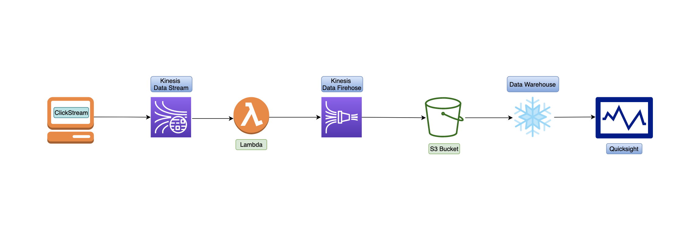
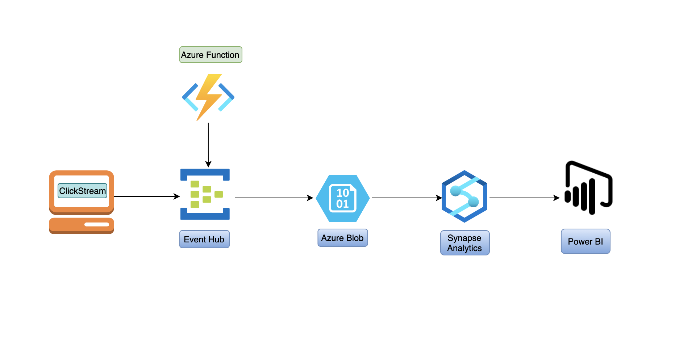
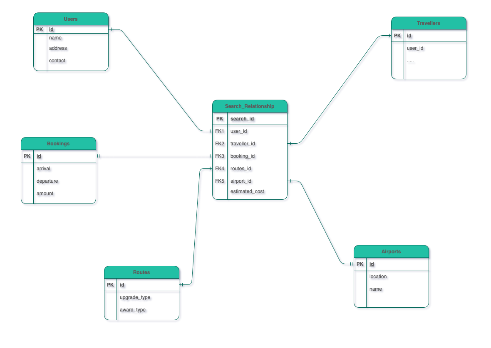

### Problem Statement
Design and build process to consume flight search data within different areas in Alaska air ecosystem to enable efficient analytics, cleaned data sets for data products and improve personalisation experience for the guest.

### Goal 
The goal is to design an architecture that can be used in efficient manner to analyse large amount of real time data. 

### How we proceed 
While creating data models we have considered the following:
* The data contained in the database
* The relationships between data items
* The constraints on data

Our data model consists of:
* Users 
* Travellers
* Bookings
* Airports
* Routes
* Search Relationship

#### Search data modeling
Here we have assumed sample data according to the input fields that can be used in this process:
``` 
{
    "id":"testID"
    "IsOneWay" : true,
    "flightType" :"f1",
    "InfantCount" : 0,
    "ChildrenCount" : 0,
    "IsMultiCity" : false,
    "IsRoundTrip" : false,
    "AdultCount" : "3 adult",
    "RequiresUmnrService" : "NA",
    "Arrival":[
        {"City":"Address1", "Date" : "<date>", "Time" : "hh:mm:ss"}
    ],
    "Departure":[
        {"City":"Address2", "Date" : "<date>", "Time" : "hh:mm:ss"}
    ],
    "DiscountCode" : "NA",
    "CabinType" : "Main Cabin",
    "AwardOption" : "MilesOnly",
    "ShopLowFareCalendar" : false,
    "FareType" : "NoUpgradePreference",
    "IncludeNearbyArrivalAirports" : false,
    "IncludeNearbyDepartureAirports" : false
}
```

#### Data Warehousing
Data warehousing is an important part of a data pipeline as it provides high scalability, increased speed and efficiency of data analytics and provides combined view of the whole data.
Data modeling using Snowflake can be considered efficient way to store the data.We can also use Synapse Analytics in case we need to use Azure. 
We can store this data in form of tables/documents listed previously.


#### Process and Tools required
After creating the efficient data model, we need to create and efficient and scalable Data Pipeline. 
To increase flexibility and scalability of the Data Pipelines, We are using cloud services which have inherent elastic capabilities.

##### The Data pipeline: step by step
* Click Stream
* Kinesis Data Stream
* Lambda Function
* Kinesis Data Firehose
* S3 bucket
* Data Warehouse(Snowflake)
* Quicksight

We can also create same pipeline using Azure cloud. The pipeline will utilize the following services when created using Azure:
* Azure Blob: 
* Event Hub
* Synapse Analytics
* Power BI
* ClickStream
* Azure Function

#### Pipeline Architecture Diagram
Below is the pipeline architectural diagram created using AWS Cloud Platform


Below is the pipeline architectural diagram created using Azure Cloud Platform


#### Pipeline Explaination

1. Real time data from the booking website can be captured using Click Stream events so that we can start analysing user behaviour.
   This in turn would help us give suggestions and relevant information back to the user.
2. This data is in the form of continuous data stream which can be processed using AWS Kinesis or Azure Hub.
3. To make this raw data suitable for analytics, We need to process this data. This processing script can be written and executed in a serverless platform like AWS lambda or Azure functions.
4. The data after getting processed is now ready for analytics and can be kept in S3 bucket or an Azure Blob. The data is now ready for visualization.
5. Data can now be loaded into various warehousing tools supported by major cloud providers like Snowflake, Redshift or Synapse Analytics.
6. We can now visualize the data by creating dashboards using tools like Power BI(Azure), Quicksight(AWS) or Tableau.

Below is the entire data model for flight search analysis:


We have created a fact table with which several dimension tables will be connected:

* "Search_Relationship" : It will store the search attributes from above Json schema as well as keys for its linked dimension tables.

Note: we have several dimension tables that will be loaded with transactional database data and will be directly related to the above fact tables.

### Assumptions
* Assuming current transactional systems are running on a server.
* Assuming we have large amount of data that are being used in this analysis process.
* Assuming we have to store real time transactional data.
* Assuming we are using 3rd party library for setting up the server.
* Assuming that the system has scalable capacity.
